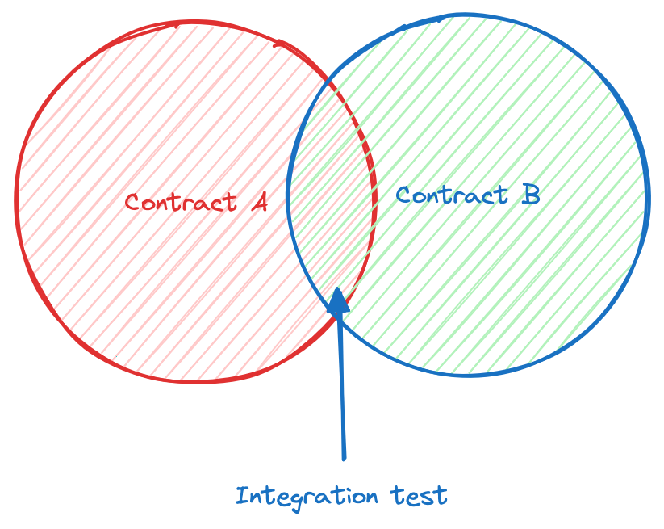

# Integration tests

Unit testing is a vital step in ensuring each individual contract works as expected. However, protocols often involve several contracts working together. It's crucial to check that these contracts interact correctly, which is where integration testing becomes essential. **The goal of the integration test should be to ensure that our contracts work together as expected, without focusing on the behavior of external contracts.**



## Points to note: 
-  It is essential to simulate the actual deployment environment as closely as possible, which means using real contract deployments instead of mocks. This ensures the tests reflect real-world operation and interactions.
-  Integration tests should concentrate on the interaction between contracts rather than repeating validations of internal logic covered by unit tests. This approach keeps tests focused and avoids redundancy.
-  Typically, integration tests follow unit tests in the development cycle. Once individual components are verified to work as expected, integration tests assess the system's overall functionality.

---

Consider a "Governance" contract that manages a `Vault` contract that manages deposits and withdrawals of ERC20 tokens. To ensure the governance and vault contracts operate without breaking, proper integration tests should be implemented. This confirms that the protocol functions properly as a whole, not just in isolation.

## Example: 

Below is a simple example for illustrating the integration test. There is a `Governance` contract that sets a value in the `Vault` contract. 

```solidity
contract Governance {
    address public owner;
    mapping(address vault => uint256 rewardRate) rewardRates;

    constructor() {
        owner = msg.sender;
    }

    modifier onlyOwner() {
        require(msg.sender == owner, "Only the owner can perform this action");
        _;
    }

    function setRewardRate(address _vaultAddress, uint256 _rewardRate) public onlyOwner {
        rewardRates[_vaultAddress] = _rewardRate;
        IVault(_vaultAddress).setRewardRate(_rewardRate);
    }
}
```

Vault contract:

```solidity
contract Vault {
...
 function setRewardRate(uint256 _rewardRate) public onlyGovernance {
        rewardRate = _rewardRate;
    }
...
}
```

To ensure integration tests are effective and reflect real-world scenarios, it's important to set up the testing environment accurately. This means using actual contract deployments rather than mock addresses or simplified versions. The goal is to closely mimic how these contracts would interact in a live setting rather than using mocks.

 So the integration test for the above contract would look something like:

```solidity
contract GovernanceIntegrationTest is Test {
    Vault vault;
    Governance governance;

    function setUp() public {
        governance = new Governance();
        vault = new Vault(address(governance));
    }

    function testGovernanceUpdatesRewardRate() public {
        uint256 newRewardRate = 100;
        governance.setRewardRate(address(vault), newRewardRate);

        assertEq(vault.rewardRate(), newRewardRate, "Vault's rewardRate should be updated to 100");
    }
}
```

The above test validates that the reward rate in the vault contract has been successfully updated by the governance contract. You can also notice that we're not validating if the `rewardRates` mapping is updated with the reward rate as it should be a unit test. 

> 💡 **Random Tip:** 
> 
> To test the functions with external call to other contracts, you can follow the [mocking](https://solidity-testing-handbook.vercel.app/basic/unit-tests.html#mocking) technique discussed in the Unit test chapter.  

## Key takeaways:
- Integration test should come after unit tests.
- All contracts should be properly setup, avoiding mock contracts.
- Should not repeat the validations performed in the unit tests. 
