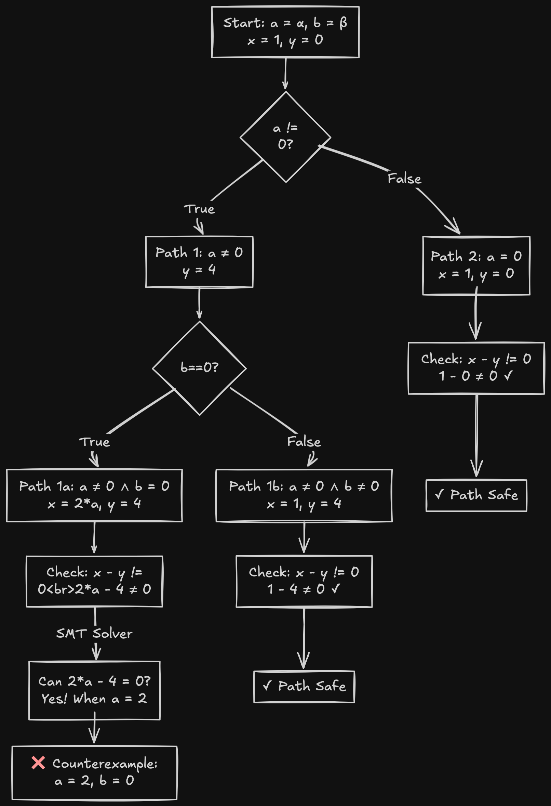

# Symbolic Testing

In the formal verification chapter, we explored Certora and CVL to mathematically prove properties of the smart contract logic. Now we'll look at symbolic testing, which is a light-weight form of formal verification that integrates directly with your existing test suite. 

Symbolic testing analyzes your code with symbolic values instead of concrete inputs. When you write a normal test with `amount = 100`, you're testing one specific scenario. With symbolic testing, `amount` becomes a mathematical symbol representing all possible uint256 values simultaneously. The symbolic execution engine explores your code's execution paths and checks whether any combination of inputs can violate your assertions.

## Understanding Symbolic Execution

Let's start with the fundamentals. When you run a normal unit test, your code executes with specific concrete values. If your test calls `withdraw(1000)`, the EVM executes that exact transaction with that exact amount. Symbolic execution works differently. It treats input variables as symbols rather than numbers, representing arbitrary values that haven't been determined yet.

Consider this simple function:

```solidity
function foobar(int a, int b) public pure {
    int x = 1;
    int y = 0;
    if (a != 0) {
        y = 3 + x;      // y = 4
        if (b == 0) {
            x = 2 * (a + b);
        }
    }
    assert(x - y != 0);
}
```

Here's how symbolic execution explores all paths through this function:



The symbolic engine starts with symbolic values α and β for inputs `a` and `b`. As it executes, it forks at each branch, creating separate paths with different constraints. Path 2 (when `a = 0`) is safe, the assertion holds. Path 1b (when `a ≠ 0` and `b ≠ 0`) is also safe. But Path 1a reveals a problem: when the SMT solver checks if `2*a - 4` can equal zero with the constraints `a ≠ 0` and `b = 0`, it finds `a = 2, b = 0` violates the assertion. This is your counterexample.

When symbolic execution encounters a branch like `if (amount > balance)` in a withdrawal function, it doesn't pick one path. Instead, it explores both paths simultaneously. For the first path, it records the constraint that `amount <= balance` must hold. For the second path, it records that `amount > balance` must hold. The symbolic engine maintains these constraints throughout execution.

At the end of each path, if your code contains assertions, the symbolic engine asks an SMT solver a question: can any concrete values satisfy all the constraints along this path and violate the assertion? If the solver finds such values, you've got a counterexample showing exactly how to trigger the bug. If the solver proves no such values exist, that path is safe. 

> [!INFO]
> Symbolic execution doesn't run your code millions of times with different inputs. It runs your code once with symbolic inputs and uses mathematical reasoning to determine what's possible across all inputs. This is why it can find bugs that fuzzing misses, even after millions of runs.

## The Mechanics of Symbolic Execution

The symbolic execution engine maintains two key pieces of state for each execution path.  
- Symbolic memory store maps variables to symbolic expressions.  
- Path condition, a logical formula capturing all the constraints that must hold for this execution path to be reachable.

When your function starts executing, input parameters are assigned symbolic values. Instead of passing concrete numbers, mathematical symbols are used to represent any possible value of that type. As execution proceeds, operations on symbolic values produce new symbolic expressions. If you write `uint256 z = x - 1` where `x` is symbolic, then `z` becomes the symbolic expression `(x - 1)`.

Branches are where it gets interesting. When the engine hits `if (z == 10)`, it forks execution into two separate paths. On the true branch, it adds the constraint `(x - 1) == 10` to the path condition. On the false branch, it adds the negation: `(x - 1) != 10`. Now you have two independent execution paths being explored simultaneously, each with its own constraints.

This forking happens at every branch in your code. 10 `if` statements create up to 1024 potential execution paths. This is called **path explosion**, and it's the primary challenge in symbolic execution. Loops make it worse. An unbounded loop could create infinite paths. This is why you need to carefully constrain your symbolic tests.

At assertion points, the engine checks each path. For a path to violate an assertion, two things must be true: 

1. The path condition must be satisfiable (there must exist concrete values that satisfy all the constraints accumulated along this path)
 
2. Those values must also satisfy the negation of your assertion. The engine constructs a formula combining the path condition with the negated assertion and hands it to an SMT solver.

SMT solvers like Z3, cvc5, Boolector, and Yices2 are mathematical engines that determine if a logical formula is satisfiable. If the solver finds a satisfying assignment, it returns concrete values that trigger the bug. If it proves the formula unsatisfiable, this path cannot violate the assertion. Different solvers have different strengths. Z3 is general-purpose and widely used. Yices2 and Boolector often perform better on bitvector constraints, which are common in EVM bytecode analysis, etc.,


## Symbolic Testing vs Fuzzing 

Let's make the comparison with an example that highlights the fundamental difference between these approaches. 


Consider this simple function:

```solidity
function check(uint256 x) external pure {
    uint256 z = x - 1;
    if (z == 6912213124124531) {
        assert(false);  
    }
}
```

If you fuzz this function with Foundry's default configuration, it runs 256 tests with random inputs. The probability of randomly generating `x = 6912213124124532` is roughly 1 in 2^256. 

You could run the fuzzer for 10 million iterations and still never hit it. The fuzzer reports success, suggesting the assertion never fails.  

```sh
[PASS] testFuzz_check(uint256) (runs: 256, μ: 9204, ~: 9204)
Suite result: ok. 1 passed; 0 failed; 0 skipped; finished in 14.26ms (9.85ms CPU time)
```


If we run symbolic testing on the same function, the symbolic engine treats `x` as a symbolic value and executes the code. When it reaches the branch, it adds the constraint `(x - 1) == 6912213124124531` to the path condition. It then checks if this constraint is satisfiable. The SMT solver immediately responds: yes, this is satisfiable when `x = 6912213124124532`. 

The symbolic test found the bug in milliseconds.

```sh
Counterexample: 
    p_x_uint256_a611e6e_00 = 0x188e9f07e00f74
[FAIL] check_property(uint256) (paths: 3, time: 0.13s, bounds: [])
Symbolic test result: 0 passed; 1 failed; time: 0.15s
```

Fuzzing is blind search through the input space. It works well when bugs are common or when any of many possible inputs trigger them. Symbolic testing is systematic search guided by program logic. It works well when bugs require specific values that satisfy certain mathematical constraints.


The takeaway is that neither tool dominates. Fuzzing excels in exploring complex sequences, and finding various types of bugs quickly. Symbolic testing is good at finding precise edge cases and verifying mathematical properties.

In practice, we should use fuzzing to explore the space of possible behaviors broadly. Use symbolic testing to verify specific properties deeply. They complement each other.

## When Symbolic Testing Provides Maximum Value

Similar to formal verification, not all contracts require symbol testing suite. It could be more useful for DeFi protocols when the contract computes interest rates, implements a bonding curve, calculates collateralization ratios, or handles token pricing, etc.

These calculations often involve sequences of multiplications and divisions where precision matters. Rounding errors can occur. Division before multiplication can round intermediate results to zero. Symbolic testing verifies your math is correct across the entire input space, not just the round numbers you thought to test.

Symbolic testing can be also useful for if your contract manages state transitions like vesting schedules, governance proposals with multiple stages, or auction states, you have invariants that must hold between all valid state transitions. Symbolic testing helps verify that no sequence of valid function calls can leave your contract in an invalid state. This is harder with fuzzing because the exact sequence needed to break an invariant might be extremely unlikely to generate randomly.


## Managing Constraints and Assumptions

Similar to Fuzz/Invariants tests, symbolic tests requires careful management of constraints. 

We can use `vm.assume()` to make sure we only feed the valid inputs to the methods. For ex, if your function requires `amount > 0`, we can use `vm.assume(amount > 0)` at the start of your test to avoid false positives. We can also constrain inputs to reasonable ranges like `vm.assume(amount < type(uint128).max)` to keep calculations in safe range and it also provides a better performance. Also, be careful not to over-constrain otherwise you might miss some bugs as the search space will be too narrow.

Here's a good pattern:

```solidity
function check_withdrawal(uint256 amount, uint256 userBalance) public {
    // Prevent expected reverts
    vm.assume(amount > 0);
    vm.assume(userBalance > 0);
    
    // Prevent overflow in calculations
    vm.assume(amount < type(uint128).max);
    vm.assume(userBalance < type(uint128).max);
    
    // Logical preconditions
    vm.assume(amount <= userBalance);
    
    // assert
    vault.withdraw(amount);
    assert(vault.totalSupply() >= 0);
}
```

## Demo: Symbolic Testing with Halmos

Halmos is a symbolic testing tool built for Solidity that integrates directly with Foundry. It takes your existing Foundry tests and executes them symbolically instead of with concrete values. You write tests in Solidity using the same `vm.assume()` and `assert()` syntax you already know from Foundry.  

There are other tools like Mythril and Manticore for bytecode-level analysis. Each has tradeoffs in speed, ease of use, and what they can verify. 

We're focusing on Halmos because it has the lowest friction for Solidity developers already using Foundry. You can learn more about Halmos at the [official repo](https://github.com/a16z/halmos) and explore other symbolic execution tools in this [detailed comparison post](https://hackmd.io/@SaferMaker/EVM-Sym-Exec).

We'll use a simplified version of the [Popsicle Finance accounting bug](https://popsiclefinance.medium.com/popsicle-finance-post-mortem-after-fragola-hack-f45b302362e0), where a transfer operation could create value out of thin air due to incorrect reward accounting. 

The example contract implements a simple staking logic where users deposit shares and earn rewards proportionally. The contract tracks fees per share globally and updates each user's reward debt when they interact with the system.

```solidity
contract MiniPopsicle {
    struct UserInfo {
        uint64 shares;           // LP tokens held by user
        uint64 paidPerShare;     // snapshot of globalFeesPerShare at last update
        uint256 rewardsDebt;     // rewards already credited
    }

    uint64 public totalShares;
    uint64 public globalFeesPerShare;
    mapping(address => UserInfo) public users;

    function _updateUser(address user) internal {
        UserInfo storage u = users[user];
        
        if (u.shares > 0) {
            uint64 delta = globalFeesPerShare - u.paidPerShare;
            u.rewardsDebt += uint256(u.shares) * uint256(delta);
            u.paidPerShare = globalFeesPerShare;
        } else {
            u.paidPerShare = globalFeesPerShare;
        }
    }

    function deposit(address to, uint64 amount) external {
        require(amount > 0, "amount=0");
        _updateUser(to);
        
        UserInfo storage u = users[to];
        u.shares += amount;
        totalShares += amount;
    }

    function addFees(uint64 rewardPerShareIncrement) external {
        require(totalShares > 0, "no shares");
        globalFeesPerShare += rewardPerShareIncrement;
    }

    // BUG: Missing _updateUser calls for both sender and receiver
    function transfer(address from, address to, uint64 amount) external {
        UserInfo storage uFrom = users[from];
        UserInfo storage uTo = users[to];
        
        require(uFrom.shares >= amount, "not enough shares");
        
        uFrom.shares -= amount;
        uTo.shares += amount;
    }

    function pendingRewards(address user) public view returns (uint256) {
        UserInfo storage u = users[user];
        uint64 delta = globalFeesPerShare - u.paidPerShare;
        return u.rewardsDebt + uint256(u.shares) * uint256(delta);
    }

    function totalWorth(address user) external view returns (uint256) {
        UserInfo storage u = users[user];
        return uint256(u.shares) + pendingRewards(user);
    }
}
```

The `transfer` function moves shares between users but doesn't call `_updateUser()` for either party. This means if the recipient has an outdated `paidPerShare` value, they'll get credit for rewards on the transferred shares that they shouldn't receive. A transfer can create value.

Let's test this property with Halmos. We want to verify that transferring shares between two users never increases their combined total worth:

```solidity
contract MiniPopsicleTest is Test {
    MiniPopsicle pops;
    
    address constant OLD = address(0x1);
    address constant NEW = address(0x2);
    
    function setUp() public {
        pops = new MiniPopsicle();
    }
    
    function check_transferDoesNotIncreaseTotalWorth(
        uint64 depOld,
        uint64 depNew,
        uint64 feesPerShareIncrement,
        uint64 transferAmount
    ) public {
        // Constrain inputs to valid ranges
        vm.assume(depOld > 0);
        vm.assume(depNew > 0);
        
        uint64 halfMax = type(uint64).max / 2;
        vm.assume(depOld <= halfMax);
        vm.assume(depNew <= halfMax);
        
        vm.assume(feesPerShareIncrement > 0);
        vm.assume(transferAmount > 0);
        vm.assume(transferAmount <= depNew);
        
        // Scenario: OLD deposits first at globalFeesPerShare = 0
        pops.deposit(OLD, depOld);
        
        // Fees accumulate
        pops.addFees(feesPerShareIncrement);
        
        // NEW deposits later at higher globalFeesPerShare
        pops.deposit(NEW, depNew);
        
        // Record combined worth before transfer
        uint256 worthBefore = pops.totalWorth(OLD) + pops.totalWorth(NEW);
        
        // Transfer from NEW to OLD
        pops.transfer(NEW, OLD, transferAmount);
        
        // Record combined worth after transfer
        uint256 worthAfter = pops.totalWorth(OLD) + pops.totalWorth(NEW);
        
        // Property: transfer should not create value
        assert(worthBefore >= worthAfter);
    }
}
```

We're using `vm.assume()` to prevent zero values, avoid uint64 overflow when adding deposits, and ensure the transfer amount doesn't exceed what NEW holds. These constraints focus the symbolic engine on the actual logic bug rather than arithmetic overflows or reverts.

The bug is "*if you give rewards to early users per share, then allow transfers of shares without updating accounting, recipients can collect rewards for time periods before they owned the shares.*"

Let's invoke halmos to see the results:

```bash
halmos --match-contract MiniPopsicleTest --match-test check_transferDoesNotIncreaseTotalWorth
```

Halmos treats all four parameters as symbolic values and explores the execution paths. In less than a second, it finds a counterexample:

```
Running 1 tests for test/symbolic/MiniPopsicleTest.t.sol:MiniPopsicleTest
Counterexample:
    p_depOld_uint64 = 0x4000000000000000
    p_depNew_uint64 = 0x4000000000000000
    p_feesPerShareIncrement_uint64 = 0x8000000000000000
    p_transferAmount_uint64 = 0x4000000000000000
[FAIL] check_transferDoesNotIncreaseTotalWorth(uint64,uint64,uint64,uint64) (paths: 13, time: 0.90s, bounds: [])
Symbolic test result: 0 passed; 1 failed; time: 0.92s
```

From the output we can see that Halmos explored 13 execution paths through our test in 0.90 seconds and found concrete values that violate the assertion. It also provides counter examples that makes the test fail. 


The exact numeric value doesn’t matter, the symbolic execution picks any values that make the property fail. Even tiny values (like depOld = 1, depNew = 1, fee = 1, transfer = 1) also violate the property, but the solver is free to return any satisfying model.

If we fix the code and try again the halmos run passes. 

```solidity
function transfer(address from, address to, uint64 amount) external {
    _updateUser(from);  // Update sender's rewards
    _updateUser(to);    // Update receiver's rewards
    
    UserInfo storage uFrom = users[from];
    UserInfo storage uTo = users[to];
    
    require(uFrom.shares >= amount, "not enough shares");
    
    uFrom.shares -= amount;
    uTo.shares += amount;
}
```

If we run the Halmos test again after fixing the contract, the run succeeds. 

```sh
[PASS] check_transferDoesNotIncreaseTotalWorth(uint64,uint64,uint64,uint64) (paths: 12, time: 4.76s, bounds: [])
Symbolic test result: 1 passed; 0 failed; time: 4.78s
```

Halmos explored all the same paths but cannot find any combination of inputs that violates the assertion. The property holds.

## Conclusion

Symbolic testing bridges the gap between traditional testing and formal verification. The key is to know when to apply it. Focus symbolic testing on financial calculations, access control logic, state machine transitions, and critical invariants. These are the areas where arithmetic bugs, edge cases, and subtle logical errors hide. Don't waste symbolic testing on simple getters, basic proxies, or contracts without complex computation.

I'd suggest you to integrate symbolic testing gradually into your pipeline. Write unit tests and fuzz tests first during development. You can slowly build symbolic tests once code is ready for audit or even you can add them when audits are underway.

Also be mindful of the limitations. Path explosion means you need to constrain inputs carefully. SMT solvers struggle with complex non-linear arithmetic and unbounded loops. Large contracts and long transaction sequences may timeout. When tests fail or timeout, don't just increase the timeout: simplify the test, narrow the constraints, or break the contract into smaller testable pieces.

Once you understand how the tool behaves, expand coverage to more functions. Over time, you'll develop intuition for what symbolic testing can verify effectively and what's better tested with other methods.

---

## Resources

To learn more about symbolic testing and related tools, feel free to explore these resources:

- **Halmos Documentation**: [github.com/a16z/halmos](https://github.com/a16z/halmos) - Official docs with examples and getting started guide
- **Symbolic Execution for Ethereum**: [hackmd.io/@SaferMaker/EVM-Sym-Exec](https://hackmd.io/@SaferMaker/EVM-Sym-Exec) - Comprehensive comparison of symbolic execution tools
- **Formal Methods Curriculum**: [github.com/WilfredTA/formal-methods-curriculum](https://github.com/WilfredTA/formal-methods-curriculum) - Deep dive into symbolic execution theory and exercises
- **Real-world Halmos Examples**: [github.com/igorganich/halmos-helpers-examples](https://github.com/igorganich/halmos-helpers-examples) - Production audit reproductions with Halmos
